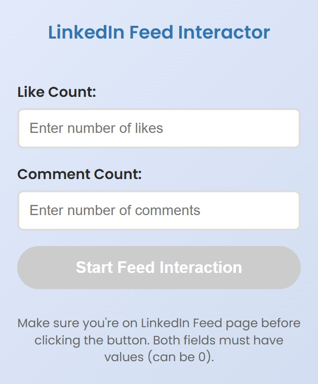

# LinkedIn Automatic Liker Chrome Extension 

This Chrome extension automates liking and commenting on LinkedIn posts based on user-defined counts.

## Features

- Auto-like posts on your LinkedIn feed
- Auto-comment (e.g., "CFBR") on posts
- Inputs to control the number of likes and comments
- Light/Dark mode toggle in popup
- Simple, clean popup UI
- LinkedIn profile scraping (for future tasks)

## 🖼 UI Preview

Here’s how the extension popup looks:




## 🛠 Tech Stack

- **JavaScript**
- **HTML + CSS**
- **Chrome Extension (Manifest V3)**
- **Express + Sequelize + PostgreSQL** (backend integration)

## How It Works

1. **User sets like & comment counts** in the popup.
2. **Clicks Start** → LinkedIn feed opens.
3. Extension:
   - Scrolls through posts
   - Likes and/or comments based on count
4. Backend can store LinkedIn profile data via API (future task).

## Setup Instructions

1. Clone this repo:

   ```bash
   git clone https://github.com/kunikasirpor/linkend_in_automatic_liker_.git
   cd linkend_in_automatic_liker_
